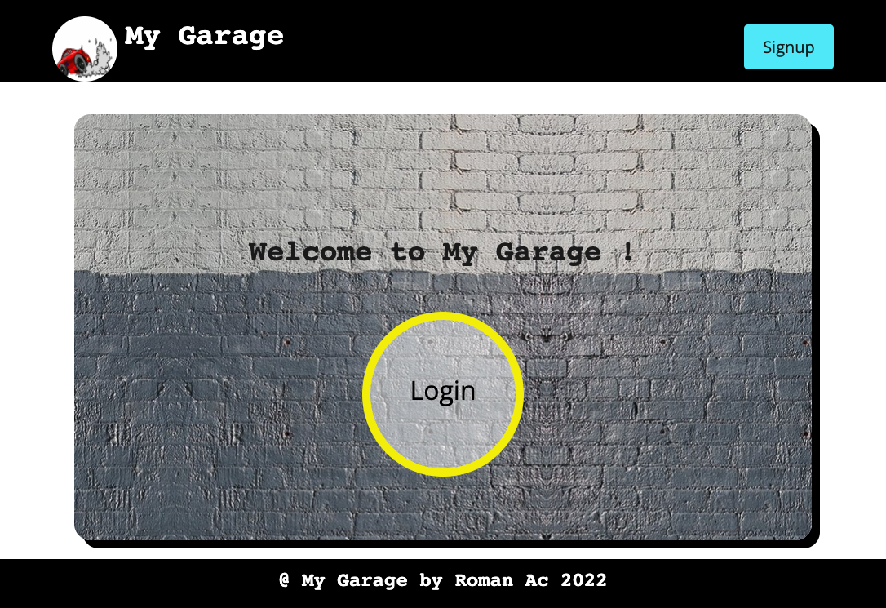
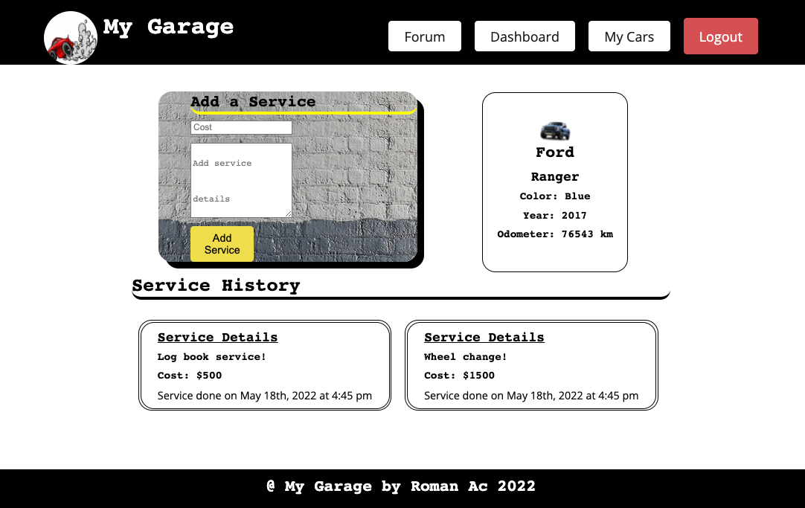
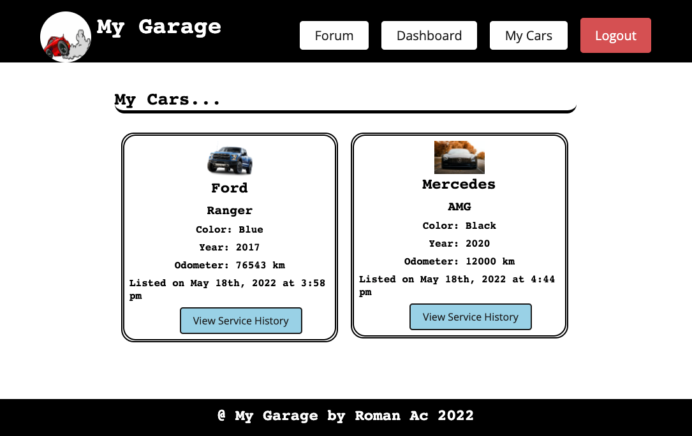
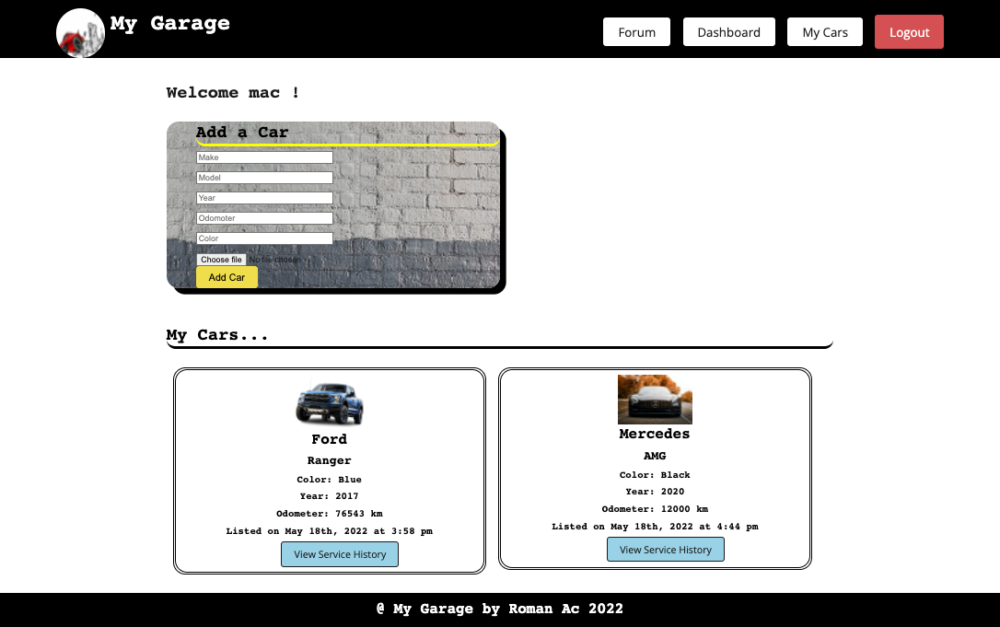

# My-Garage

## Table of Contents
  * [User Story](#user-story)
  * [Technology Used](#technology-used)
  * [GITHUB page](#github-page)
  * [Deployed App Link](#deployed-app-link)
  * [Screenshots](#screenshots)
  * [Contributors](#contributors)

## User Story

AS A developer
I WANT to create an App where a user can logoin and store their car details and also log the service history of each car with date and time stamp.
    

## Technology Used

    * Mongo DB, for database
    * React, for the front end
    * HTML
    * CSS, for styling
    * Javascript(language), front and back end
    * GraphQL, for back end, dataquery, manipulation and API's
    * express, for API's
    * NodeJS, backend JS runtime environment
    

## GITHUB page

[Github](https://github.com/roman-ac/my-garage-by-roman-ac)

## Deployed App Link

[App Link](https://infinite-sierra-17727.herokuapp.com/)

# Screenshots

  
  

  
  

  
  

  
  

## Contributors
  ### Reach out here: 
  [roman-ac](https://github.com/roman-ac)